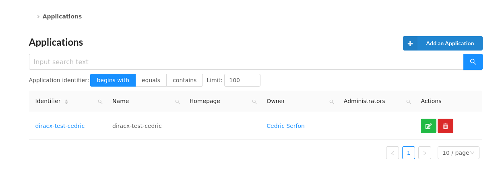
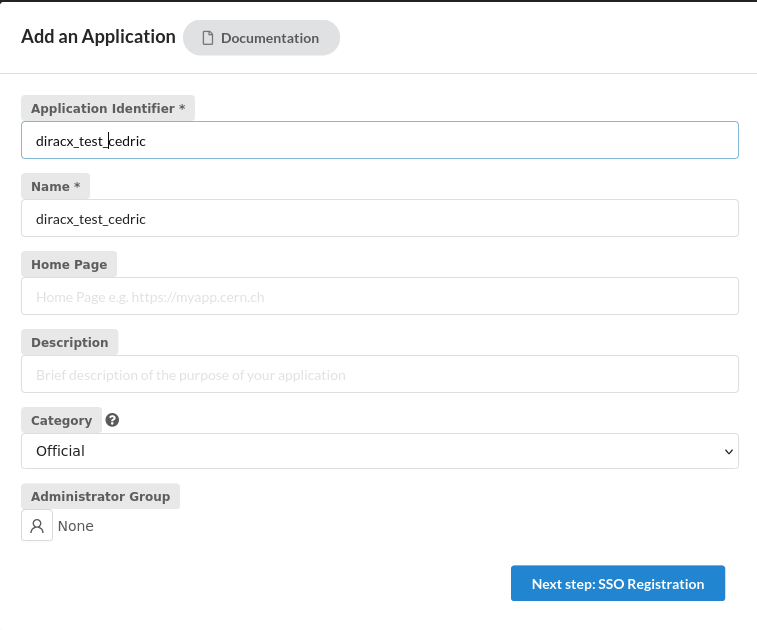
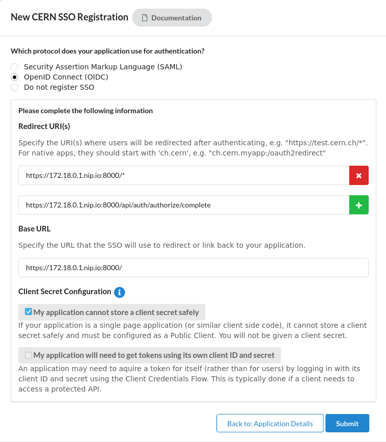

u# How to enable CERN SSO with DiracX

## Registering the service in SSO

Detailed instructions can be found here : https://auth.docs.cern.ch/applications/adding-application/ 
 Go to https://application-portal.web.cern.ch/



Click on Add an application. Fill the application details withe the Name of your service



Go to Next step and fill the form with the following parameters :


Then submit.

## Configuring DiracX

Update `run_demo.sh` to by changing the idp-url to `https://auth.cern.ch/auth/realms/cern` and `idp-client-id` to the application identifier you registered previously


```
     --idp-url="https://auth.cern.ch/auth/realms/cern" \
     --idp-client-id="diracx-test-cedric" \
```

And create your account in the DIRAC CS

```
    "${demo_dir}/kubectl" exec deployments/diracx-demo-cli -- bash /entrypoint.sh  dirac internal add-user /cs_store/initialRepo \
     --vo="diracAdmin" \
    --sub="<cernaccount>" \
     --preferred-username="admin" \
     --group="admin" >> /tmp/init_cs.log
```


## Extracting users from an egroup

Members from an egroups can be extracted with the following query (replace `diracproject-users` by the egroup you want to query) :
```
curl --no-progress-meter --insecure "ldaps://xldap.cern.ch/OU=Users,OU=Organic Units,DC=cern,DC=ch?name?sub?(&(objectClass=user)(memberOf=CN=diracproject-users,OU=e-groups,OU=Workgroups,DC=cern,DC=ch))"  | grep name | awk -F ":" '{print $2}' | tr -d '[:blank:]'
```
